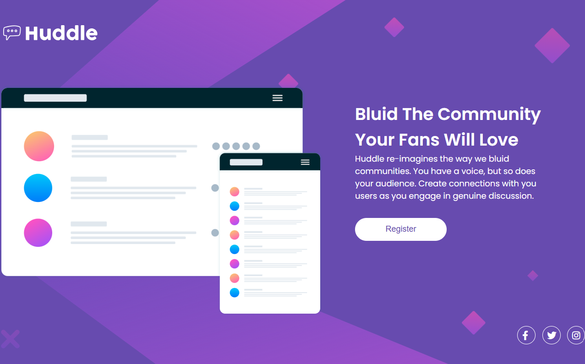

# Projeto Huddle Base 
A solução do projeto Huddle Base, da Frontend Mentor, faz parte da Quest do DevQuest e contribui para o aprimoramento das habilidades de codificação, com foco nos estudos do curso.

## Conteúdos
- [O Desafio](#Odesafio)
- [Captura de tela](#Capturadetela)
- [Link](Link)
- [Tecnologias Utilizadas](#Tecnologiasutilizadas)
- [Autor](Autor)
- [Agradecimentos](Agradecimentos)

### O Desafio
Este projeto foi desenvolvido com layout responsivo, permitindo que os usuários visualizem a interface de forma adequada tanto em desktop quanto em dispositivos móveis, incluindo todos os estados dos elementos interativos.

### Captura de tela

### Link
- [Projeto]()

### Tecnologias utilizadas
- HTML
- CSS
- Flexbox 

### Autor
- Linkedin - [Aline Seravali](https://www.linkedin.com/in/aline-seravali-bandeira-meireles-da-silva-b8b8311b6)

- Frontend Mentor - [@DevSeravali](https://www.frontendmentor.io/profile/devseravali)

- GitHub - [@DevSeravali](https://github.com/devseravali)

### Agradecimentos
Agradeço ao DevQuest pela oportunidade de desenvolver este projeto do zero como parte da minha primeira Quest.
